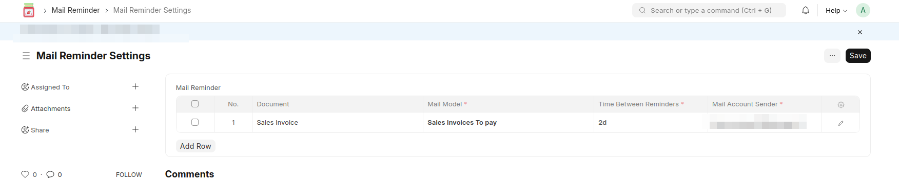
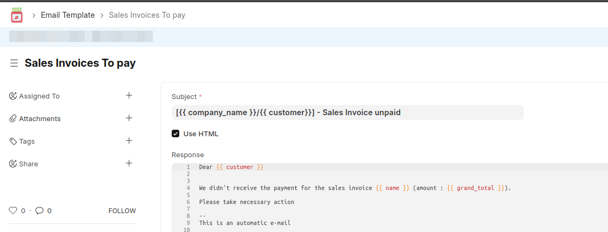

## Mail Reminder

This apps adds the possibility of enabling an automatic mail reminder for 4 kinds of transactions (Sales orders, Sales invoices, Purchase Orders, Supplier quotations). 

Supplier and Customer have "Automatic Mail Dunning" checkbox. 
When a Sales orders, Sales invoices, Purchase Orders, Supplier quotations 
is created the "Automatic Mail Dunning" checkbox on the transaction (on Terms tab) is defaulted with party one, it can be unchecked even if transaction is submitted

A task will daily check if documents should be reminded to the contact set in it.

Example of setting Mail Reminder:


Email Template



### INSTALL 

- Via [bench](https://github.com/frappe/bench)

    ```bash
       bench get-app https://github.com/scopen-coop/frappe-mail-reminder.git
       bench --site $MY_SITE install-app mail_reminder
    ```

      
#### License

gpl-3.0
